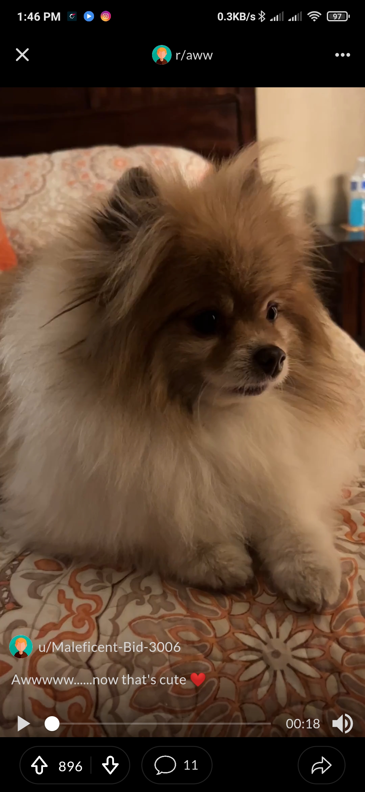
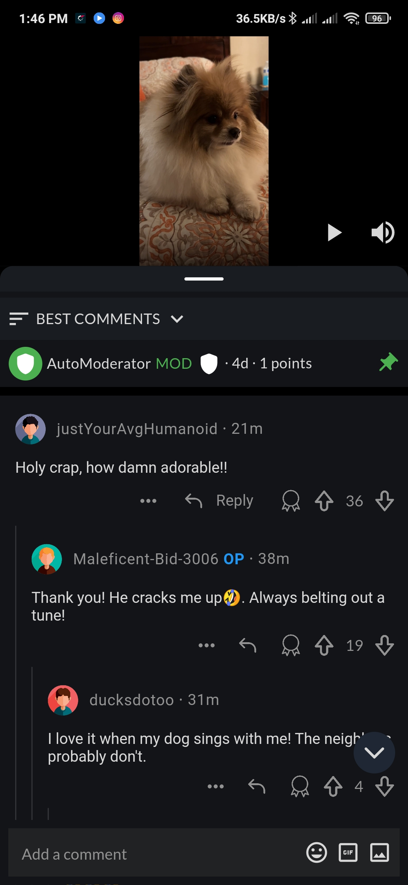

### README.md

---

# Reddit Clone App

## Introduction
The Reddit Clone App is a feature-rich application designed to emulate the core functionalities of the popular social media platform Reddit. This app includes dynamic animations, interactive video controls, comment management, and localization support. It is built with responsiveness in mind, ensuring a seamless experience across different screen sizes. The app utilizes the BLoC state management pattern for efficient state handling.

## Features
- **Video Playback**: Play, pause, and mute video functionality.
- **Interactive Comments**: View comments, like them, and reveal hidden replies.
- **Animations**: Smooth animations for a better user experience.
- **Localization**: Support for multiple languages.
- **Responsive Design**: Adaptable layout for various screen sizes.

## Packages Used
- `video_player`
- `flutter_bloc`
- `flutter_screenutil`
- `timeago`

## Installation
1. **Clone the repository:**
    ```bash
    git clone https://github.com/TGOHL/reddit_clone_v2.git
    cd reddit_clone_v2
    ```

2. **Install dependencies:**
    ```bash
    flutter pub get
    ```

3. **Run the app:**
    ```bash
    flutter run
    ```

## Implementation Details
### Video Playback
- The app uses the `video_player` package to handle video playback, allowing users to play, pause, and mute videos seamlessly.

### State Management
- `flutter_bloc` is used for state management, ensuring a predictable and scalable way to manage the app's state.

### Screen Utilization
- `flutter_screenutil` is utilized to ensure the app's UI is responsive and adapts to different screen sizes effectively.

### Time Display
- The `timeago` package is implemented to show time in a human-readable format, enhancing the user experience in comment sections.

### Localization
- The app includes localization support, making it accessible to users from different linguistic backgrounds.

### Animations
- Smooth and dynamic animations are integrated to improve the overall user experience and interaction within the app.

## Screenshots
- Video Playback.
<p float="left">
  
</p>

- Comments Section.
<p float="left">
  
</p>

## To See The App In-Action
- Satch the demo video [here](https://github.com/TGOHL/reddit_clone_v2/tree/main/output).
- Try the debuggable APK Version [here](https://github.com/TGOHL/reddit_clone_v2/tree/main/output).

## Conclusion
The Reddit Clone App is designed to provide a robust and interactive experience similar to Reddit. With its comprehensive feature set and responsive design, it aims to deliver a seamless user experience across various devices.
